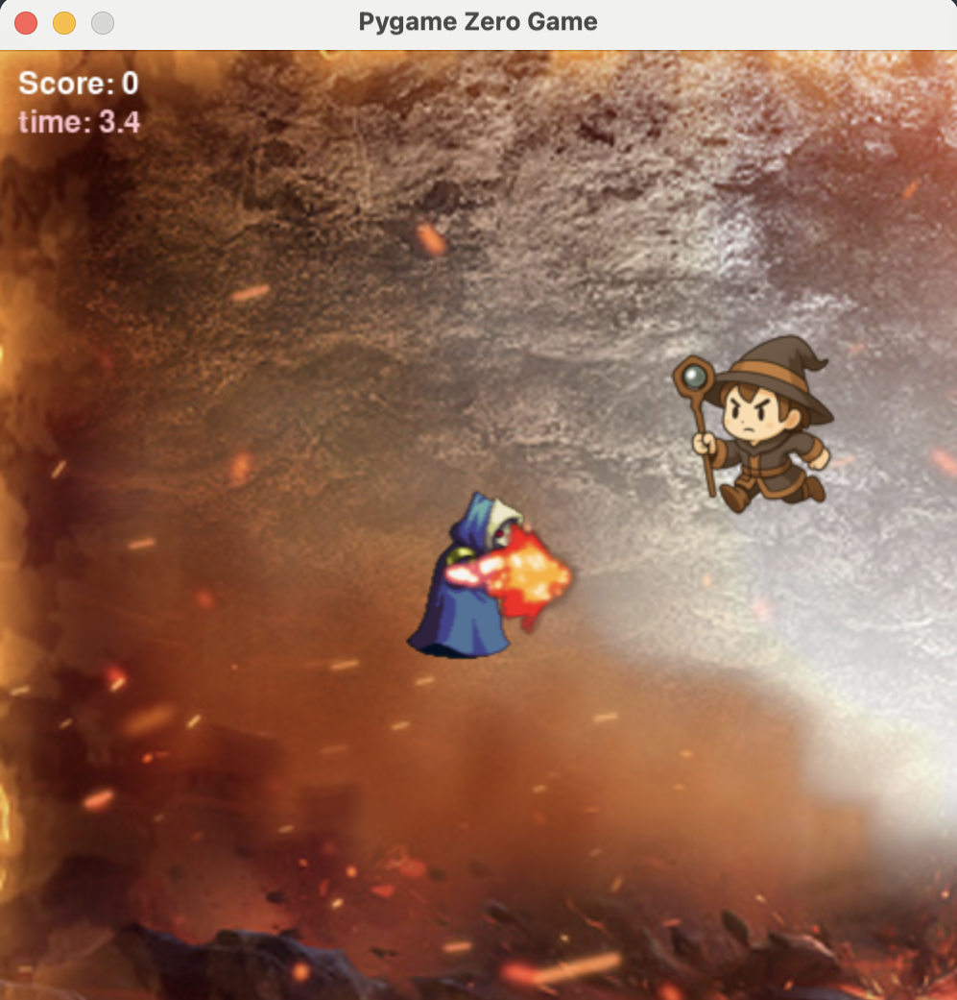

# 🧙‍♂️ Wizards Battle
My first 2D arcade-style game built with Python and Pygame Zero where you play as a wizard defending against approaching enemies using magical fireballs!

What I initially thought would be the most challenging aspect of my game—controlling player and enemy movement—turned out to be surprisingly straightforward. Through this project, I learned to implement enemy movement that responds to player position and add sound effects and animations. 

I really enjoyed controlling the player and the enemy. I discovered that player movement was essentially about reading keyboard inputs and linking enemy behavior to player coordinates. My approach was to compare the player's X position with the enemy's, moving the enemy right when the player's X value was greater, then calculating the distance in both directions to maintain consistent movement speed toward the player. 

However, animating the enemy's death sequence when struck by a fireball was a bit challenging. After discussing with my teacher, I learned to cycle through different sprite images in each frame using a flag variable to control the animation’s start and stop states. 

 <!-- Add a screenshot of your game -->

I used AI help to write more detailed comments in version 4 ( wizadrs_battleV4.py) so anyone can understand what I did. 

## 🎮 Game Features

- **Real-time Combat**: Cast fireballs to defeat approaching enemies
- **Dynamic Enemy AI**: Enemies intelligently track and chase the wizard
- **Smooth Animations**: Death animations and character movement
- **Score System**: Earn points for each enemy defeated
- **Time-based Gameplay**: Survive waves of enemies within time limits
- **Directional Controls**: Move in all directions and face enemies
- **Sound Effects**: Immersive audio feedback for actions

## 🎯 Who is this game for?

- Other students like me learning Python game development

## 🛠️ What you need in advance

- **Python 3.6+**
- **Pygame Zero** (`pgzrun`)
- **text editor like sublimetext**
- **Standard Libraries**: `time`, `random`

## 📦 Ensure you have the require files
   
   Create an images folder and add these `image` files:
   - `wizard.png`
   - `wizard_flip.png`
   - `fire_ball.png`
   - `fire_ball_flip.png`
   - `enemy_stand.png`
   - `enemy_running.png`
   - `enemy_running_flip.png`
   - `enemy_die.png`
   - `gameover.png`
   - `background.png`

   Create a `sounds` folder and add:
   - `lasergun.wav`
     
**🎮 Controls**

- **Arrow Keys**: Move the wizard (Up, Down, Left, Right)
- **Spacebar**: Cast fireball
- **N**: Restart game (when game over)

**🎯 Gameplay**

1. Use arrow keys to move your wizard around the screen
2. Enemies will spawn and chase you intelligently
3. Press spacebar to cast fireballs at enemies
4. Earn 10 points for each enemy defeated
5. Survive as long as possible within the time limit
6. Avoid letting enemies reach you!

**🏗️ Project Structure**

